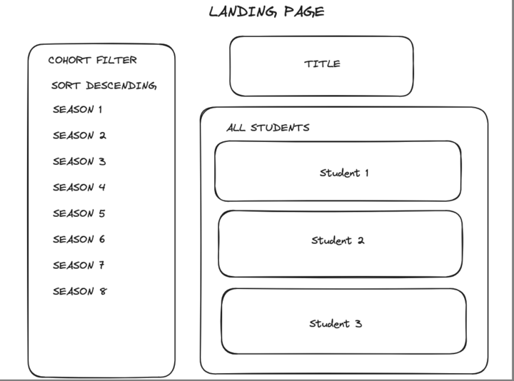
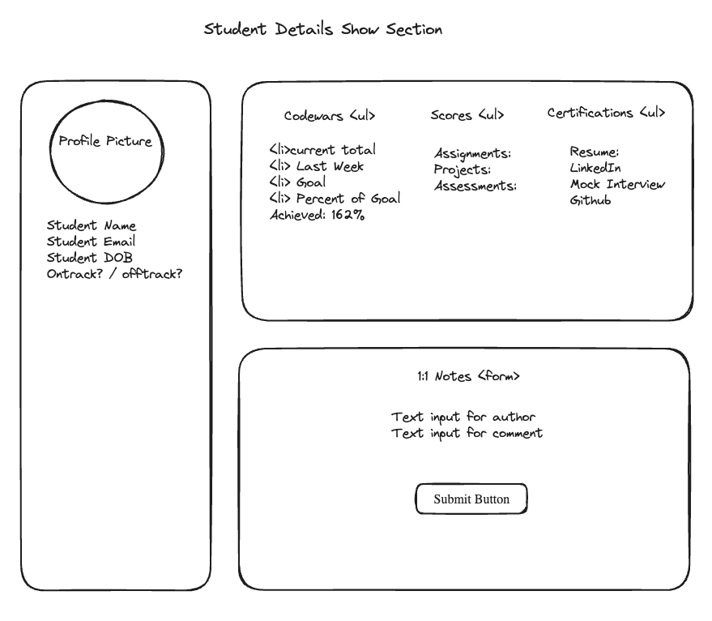
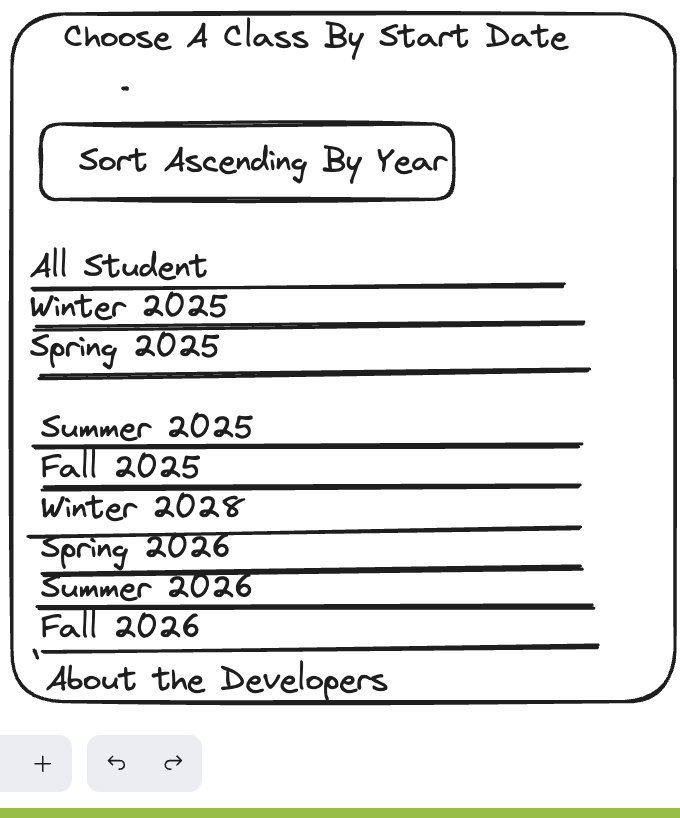

# Project Notes and Planning

We will be editing this repo: https://github.com/cristiangarc/project-student-dashboard-reboot/tree/main

## Wire Frames

This section will demonstrate how our react app will be structured

### Landing Page View
Contains:
    Header
    Aside
    Sections that change into views

### Student Details View

### Cohort List aside component 
**This component will be featured in all views**

Test